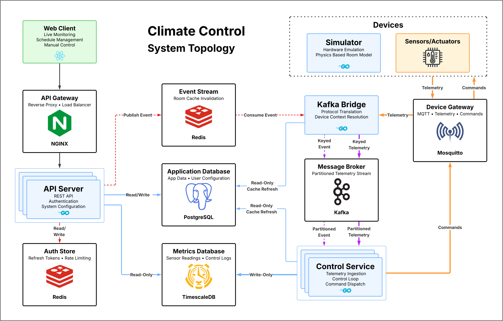

# Climate Control System

A distributed IoT backend and React web client built in Go — MQTT telemetry ingestion, bang-bang control loop, TimescaleDB time-series metrics, JWT auth, and horizontal scaling via Kafka partition-per-room ownership.



---

## What it is

The system lets users maintain target temperature and humidity conditions across multiple rooms automatically. Each room has climate devices assigned to it — sensors that measure conditions and actuators (heaters, humidifiers) that change them. Users set targets for each room either as a persistent hold or via a weekly schedule, and the system handles the rest: reading sensor data, deciding whether to activate or deactivate each actuator, and sending commands to the hardware.

The web client gives a live view of every room's current conditions, active control state, and climate history. From there users can adjust targets, configure schedules with per-day time windows, and manage device assignments.

**The room is the atomic unit of the system.** A room can have multiple sensors per measurement type — their readings are averaged to produce a single value before the control decision is made. Multiple actuators in the same room respond to the same control output. This room-centric model carries through the entire architecture: the control loop runs once per room per tick, the in-memory cache is keyed by room, and in the scaled configuration each room hashes deterministically to one Kafka partition owned by one Control Service instance — so a room's telemetry and state changes are always processed by the same instance with no coordination required.

A Simulator stands in for physical hardware — it provisions realistic room topologies via the API and publishes sensor telemetry over MQTT just as a real ESP32 would. The system cannot tell the difference, which makes the full control loop demonstrable without any hardware.

<!-- Demo video thumbnail — replace src and href once recorded -->
<!-- [](https://youtube.com/watch?v=...) -->

---

## Architecture

The system has two converging data paths. On the left of the diagram, the web client communicates with the API Server through NGINX. On the right, ESP32 devices and the Simulator publish telemetry via MQTT through the Device Gateway into Kafka, where the Control Service consumes it by partition. Both paths converge on shared data stores in the middle.

The telemetry and command paths are intentionally asymmetric. Telemetry flows device → Mosquitto → Kafka Bridge → Kafka → Control Service. Commands flow Control Service → Mosquitto → device directly, bypassing Kafka entirely — commands are point-to-point and low-volume with no benefit from Kafka's ordering or fan-out guarantees.

Cache invalidation events (desired state changes, schedule activations, device reassignments) originate in the API Server, enter Redis Stream, are forwarded by the Kafka Bridge into a dedicated Kafka topic keyed by `room_id`, and are consumed by the same Control Service instance that owns that room's telemetry partition. In Phases 3–6 before Kafka is introduced, the Control Service consumes the Redis Stream directly with a per-instance consumer group.

---

## Key design decisions

**Declarative desired state over imperative commands.** The API Server writes user intent to PostgreSQL. The Control Service recomputes effective state every tick from durable sources — manual override, active schedule period, grace period, or OFF. A restarted instance warms its cache and immediately knows what every room should be doing with no command replay. Effective state is never persisted.

**Partition-per-room ownership for horizontal scaling.** Each room's `room_id` hashes via murmur2 to one of 24 Kafka partitions. One Control Service instance owns each partition subset. This guarantees a room's telemetry and invalidation events are always processed by the same instance — no duplicate control decisions, no cache incoherence across instances.

**Kafka Bridge as the single ingestion point.** The Kafka Bridge translates two data sources into Kafka: MQTT telemetry from Mosquitto and cache invalidation events from Redis Stream. Both are keyed by `room_id` so the same partition ownership model routes both to the correct instance. The Control Service has no direct dependency on Mosquitto or Redis in Phase 7.

**In-memory cache with event-driven invalidation.** The Control Service maintains a per-room in-memory cache warmed from PostgreSQL at startup. It never queries the database on the hot path — the control loop tick reads only from the cache under a read lock. Redis Stream (Phases 3–6) or Kafka (Phase 7) delivers invalidation events when the API Server writes state changes, triggering targeted cache reloads that preserve live runtime fields.

**Simulator as a faithful hardware replacement.** The Simulator connects to Mosquitto with the same credentials and publishes to the same topics as physical ESP32s. The Control Service cannot distinguish them. Room state evolves via a physics model that responds to actuator commands, so the control loop closes in real time — temperature and humidity readings reflect what the relay commands actually did.

---

## Tech stack

| Layer | Technology |
|---|---|
| Backend services | Go 1.25 |
| REST API | Gin · GORM · golang-jwt |
| Messaging | Eclipse Mosquitto 2.x · Apache Kafka (KRaft) |
| Application data | PostgreSQL 17 |
| Metrics | TimescaleDB 2.x (hypertables) |
| Session / events | Redis (tokens · rate limiting · stream) |
| Infrastructure | Docker Compose · NGINX |
| Web client | React 19 · Vite · SWR · Recharts · shadcn/ui · Tailwind |
| Testing | Postman · Newman · GitHub Actions |

---

## Project structure

```
climate-control/
├── api-service/          # REST API — rooms, devices, schedules, auth
├── device-service/       # Control Service — telemetry ingestion, control loop
├── simulator-service/    # Simulator — virtual ESP32s, physics room model
├── kafka-bridge/         # Kafka Bridge — MQTT + Redis Stream → Kafka (Phase 7)
├── web-client/           # React SPA dashboard
├── deployments/          # NGINX config, Mosquitto config, Docker Compose services
├── migrations/           # golang-migrate SQL migrations (appdb + metricsdb)
├── tests/postman/        # Integration and smoke test collections
├── docs/
│   ├── architecture/     # Architecture docs and diagrams — see Documentation section
│   ├── OPERATIONS.md     # Make targets, env vars, scaling, debug flags
│   └── DEMO.md           # Demo walkthrough and simulation configurations
├── docker-compose.yml    # Infrastructure — PostgreSQL, TimescaleDB, Redis, Mosquitto
├── Makefile
└── .env.example
```

---

## Running locally

**Prerequisites:** Docker Desktop, Docker Compose v2, Go 1.25

```bash
# Clone and enter the repo
git clone https://github.com/your-username/climate-control
cd climate-control

# Bootstrap environment (one-time)
cp .env.example .env
make mosquitto-passwd

# Start the full stack
make up

# Start the demo simulation
make demo
```

The web client will be available at `http://localhost` once the stack is healthy.

For full operational documentation — environment variables, scaling, debug flags, simulator configurations — see [`docs/OPERATIONS.md`](docs/OPERATIONS.md).

---

## Development phases

| Phase | Scope | Status |
|---|---|---|
| 1–4c | Repo scaffold, full REST API, Control Service, Simulator, CI, reactive room model | ✅ Done |
| 5a | Climate history endpoints (`GET /rooms/:id/climate/history`) | ✅ Done |
| 5b | NGINX reverse proxy, load balancing, horizontal scaling | ✅ Done |
| 6a | React SPA scaffold — auth flow, routing, SWR setup | ✅ Done |
| 6b | Dashboard room cards, room detail, overview tab, SWR hooks, room capabilities | ✅ Done |
| 6c | Desired state schema migration, control panel wiring | 🔄 In progress |
| 6d–6e | History charts, schedules, device management | Planned |
| 7a | Kafka Bridge service, Kafka cluster | Planned |
| 7b | Control Service Kafka source, partition ownership, Kafka-routed invalidation | Planned |
| 8 | Full CI suite, architecture diagrams, README, one-command startup | Planned |

---

## Documentation

### Architecture

| Document | Description |
|---|---|
| [`docs/architecture/control-service.md`](docs/architecture/control-service.md) | Control Service — cache design, control loop, invalidation, scaling |
| [`docs/architecture/control-service-reference.md`](docs/architecture/control-service-reference.md) | Control Service — data structures, startup sequences, timing constants, MQTT topics |
| [`docs/architecture/simulator.md`](docs/architecture/simulator.md) | Simulator — physics model, config system, goroutine structure |
| [`docs/architecture/simulator-reference.md`](docs/architecture/simulator-reference.md) | Simulator — YAML schema, data structures, provisioning sequence, timing derivation |
| [`docs/architecture/kafka.md`](docs/architecture/kafka.md) | Kafka Bridge and Phase 7 horizontal scaling design |
| [`docs/architecture/client.md`](docs/architecture/client.md) | Web client — auth flow, SWR patterns, design decisions |
| [`docs/architecture/client-reference.md`](docs/architecture/client-reference.md) | Web client — file structure, hook inventory, route table, design tokens |
| [`docs/architecture/schema.md`](docs/architecture/schema.md) | Database schema ERD — appdb and metricsdb |

### Operations and demo

| Document | Description |
|---|---|
| [`docs/OPERATIONS.md`](docs/OPERATIONS.md) | Make targets, environment variables, scaling, debug flags |
| [`docs/DEMO.md`](docs/DEMO.md) | Demo walkthrough and simulation configurations |