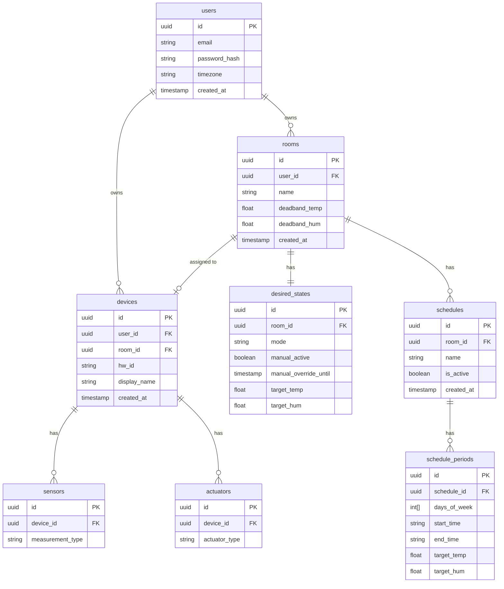
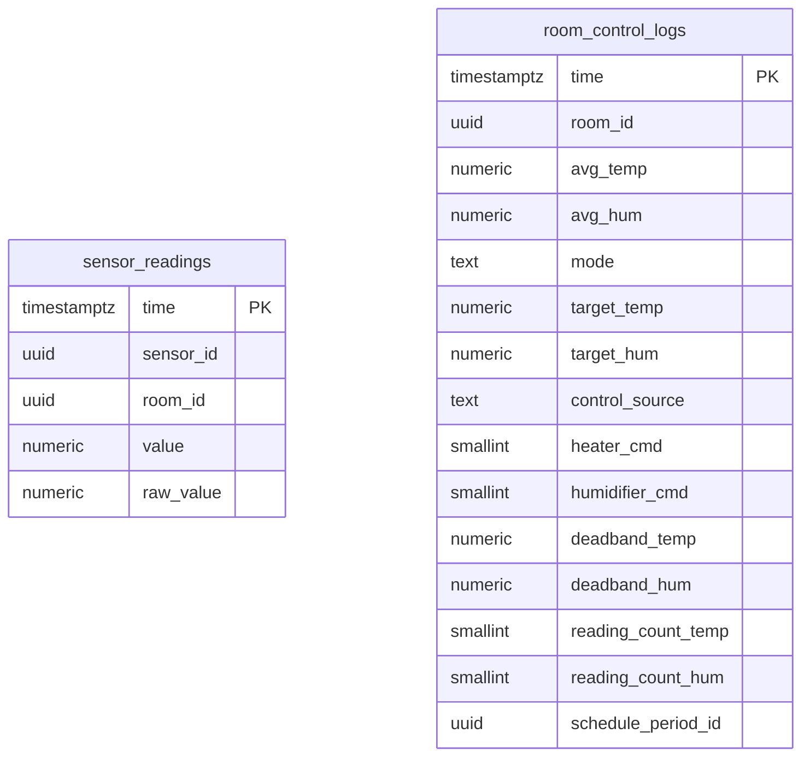

# Database Schema

The system uses two separate databases with distinct purposes.

**PostgreSQL (appdb)** — application data. Owns all user-facing configuration: users, rooms, devices, sensors, actuators, schedules, schedule periods, and desired state. Written and read by the API Server. Read-only by the Control Service for cache warm.

**TimescaleDB (metricsdb)** — time-series metrics. Append-only sensor readings and control loop logs. Written exclusively by the Control Service. Read-only by the API Server for climate history endpoints.

---

## Entity relationship diagram

---

## TimescaleDB hypertables

Both tables are TimescaleDB hypertables partitioned by `time` with 1-day chunks. They are shown separately from the appdb ERD — no foreign key constraints exist across databases.

---

## Schema notes

**`desired_states` — one row per room, always**
Created in the same transaction as the room. `room_id` is the natural primary key — `id` is vestigial. Targets (`target_temp`, `target_hum`) persist independently of `manual_active` and `mode` — they represent saved preferences even when manual control is inactive. `manual_active = false` means the scheduler controls the room; `manual_override_until` is always null in this state. `manual_active = true` + `manual_override_until = 9999-12-31T23:59:59Z` means indefinite manual override. `manual_active = true` + `manual_override_until = <timestamp>` means timed manual override.

**`devices.room_id` is nullable**
A device exists independently of room assignment. Unassigned devices publish telemetry that the Control Service drops silently — no room context available.

**`sensor_readings.room_id` is snapshotted at write time**
When the Control Service writes a sensor reading, it stamps the device's current room assignment onto the row. This preserves accurate historical metrics after a device is reassigned — historical data is correctly attributed to the room where the reading was taken, not where the device is today.

**`heater_cmd` / `humidifier_cmd` are SMALLINT, not BOOLEAN**
`AVG()` over SMALLINT produces a duty cycle fraction (0.0–1.0) at any time bucket resolution without casting. A bucket where the heater was on for half the ticks returns 0.5 — directly usable as a chart fill opacity.

**`deadband_temp` / `deadband_hum` are snapshotted on control logs**
Preserves historical context when deadband settings change. The history chart can show the correct deadband overlay for any historical window even after the user has adjusted their tolerances.

**`schedule_periods.days_of_week`** uses ISO 8601 day numbering: Monday = 1, Sunday = 7. Stored as a PostgreSQL integer array. Overlap detection uses the `&&` array overlap operator.

**`schedule_periods.start_time` / `end_time`** stored as `HH:MM` strings. Midnight-crossing periods are not supported — `end_time` must be strictly greater than `start_time`.

**`control_source` values:** `manual_override` · `schedule` · `grace_period` · `none`

**`mode` values:** `OFF` · `AUTO`